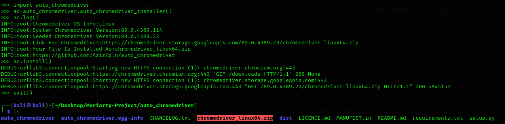

# INSTALLATION
> pip3 install auto_chromedriver 

# USAGE

> Call The Module

```
import auto_chromedriver
ac=auto_chromedriver.auto_chromedriver_installer()
ac.install()
```
### ac.install() installs the chromedriver for your system instantly


```
import auto_chromedriver
ac=auto_chromedriver.auto_chromedriver_installer()
ac.log()
```

### ac.log() is used for printing the information of chromedriver

# 
